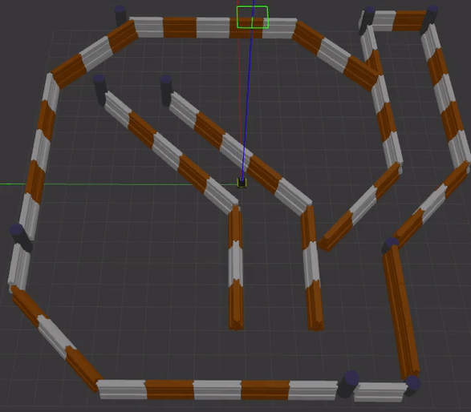
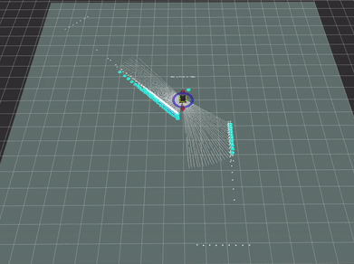
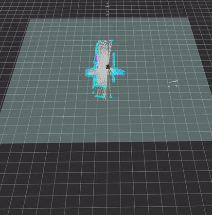
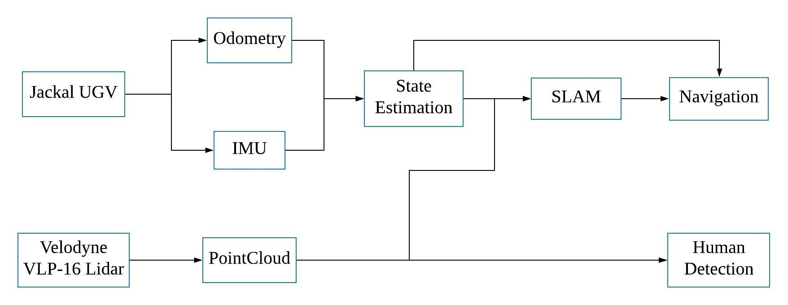

# SLAM with Velodyne Lidar and Jackal UGV
#### Individual Project, Winter 2019, Northwestern University
#### Chenge Yang

-----------------------------------------------------------------------------------------
## Demo

### SLAM in Simulation (Gazebo)
<p align = "center">
  
  
</p>

### SLAM in MSR Lab
<p align = "center">
  
  
</p>

### Pedestrian Detection
<p align = "center">
  
  
</p>

-----------------------------------------------------------------------------------------
## Introduction
The goal of this project is to build a mobile robot system in both simulation and real-world environments to achieve SLAM, autonomous navigation and pedestrian detection with Velodyne VLP-16 Lidar sensor and Clearpath Jackal UGV.

#### Hardware
* Clearpath Jackal UGV with Ubuntu 14.04 / ROS Indigo
* Velodyne VLP-16 Lidar
* PC with Ubuntu 18.04 / ROS Melodic

#### Simulation
Simulation is established for the Jackal and Velodyne VLP-16 Lidar in Gazebo and rviz.

-----------------------------------------------------------------------------------------
## Implementation

#### Pipeline Flow
<p align = "center">
  
</p>

### State Estimation
The package **robot_localization** is used to fuse Odometry with IMU data through **Extended Kalman Filter**. It estimates the robot state and provides the transformation between tf frames **/odom** and **/base_link**.

### PointCloud Processing
The raw Lidar PointCloud is processed in C++ using PCL library. The following steps are implemented:
1. Find the floor plane and remove it from the raw PointCloud
2. Remove all points that are higher than the robot, lower than the ground and too close to the robot
3. Get rid of noisy points that have no neighbour points within a particular radius
4. Downsample to obtain a less dense PointCloud

### SLAM
I used the 2D SLAM package **gmapping**, which implements the Rao-Blackwellized Particle Filter to generate a 2D grip costmap and the the localizaion of the robot in the map (transformation between tf frames **/map** and **/odom**).

### Navigation
I used package **move_base** to achieve autonomous navigation of Jackal. It reads the map and localization from gmapping and plans a local and global path for the robot.

### Pedestrian Detection
I used package **hdl_people_tracking** to achieve pedestrian detection and tracking with Velodyne Lidar. It generate semantic segmentation of the human clusters in the PointCloud.

-----------------------------------------------------------------------------------------
## Dependencies and Installation
The Jackal packages are released in ROS Indigo and Kinetic. To use them in ROS Melodic, the following compiling processes are implemented:

#### Build from apt-get:
Install in Terminal with **sudo apt-get install**:
* ros-melodic-velodyne
* ros-melodic-velodyne-description
* ros-melodic-velodyne-simulator
* ros-melodic-geographic-info
* ros-melodic-robot-localization
* ros-melodic-twist-mux
* ros-melodic-pointcloud-to-laserscan

#### Build from source: (version: kinetic)
Git clone the original Github repo to local catkin workspace, and run **catkin_make**.
* [jackal_desktop](http://wiki.ros.org/jackal_desktop)
* [jackal_simulator](http://wiki.ros.org/jackal_simulator)
* [jackal_navigation](http://wiki.ros.org/jackal_navigation)
* [lms1xx](http://wiki.ros.org/LMS1xx)
* [pointgrey_camera_driver](http://wiki.ros.org/pointgrey_camera_driver)
* [interactive_marker_twist_server](http://wiki.ros.org/interactive_marker_twist_server)
* [gmapping](http://wiki.ros.org/gmapping)
* [openslam_gmapping](http://wiki.ros.org/openslam_gmapping)
* [ndt_omp](https://github.com/koide3/ndt_omp)
* [hdl_localization](https://github.com/koide3/hdl_localization)
* [hdl_people_tracking](https://github.com/koide3/hdl_people_tracking)

-----------------------------------------------------------------------------------------
## Usage

### Launch in simulation:
```
roslaunch winter_project simulation.launch
```
### Launch in Jackal:

* SSH into Jackal, and run:
```
roslaunch winter_project real_jackal.launch
```
* Open a new Terminal, and run:
```
export ROS_MASTER_URI=http://CPR-J100-0076.local:11311
export ROS_HOSTNAME=robostation.local
roslaunch winter_project real_pc.launch
```
### Use rosbag to record data in Jackal
```
rosbag record
scp -r rosbag.bag ethan@robostation.local:~/Downloads
```

-----------------------------------------------------------------------------------------
## Jackal Setup

### Router connection
* Connect to **JACKALROUTER24**; Password: **jackbenimble**
```
nmcli connection up JACKALROUTER24
```
* SSH into Jackal
```
ssh administrator@192.168.0.100
Password: clearpath
```

### Direct Ethernet connection
```
nmcli connection up Jackal
ssh administrator@cpr-j100-0076.local
```

### PS3 Joystick
* Plug into the laptop will erase the memory. Reset up required.
* Connect the joystick to the Jackal through USB
* SSH into jackal
* Run
```
sudo sixpair
sudo sixad --boot-yes
```
* Unplug the joystick, long hold the playstation button

### Files on Jackal
* **catkin_ws** workspace for Nate
* **jackal_ws** workspace for Michael
* **chenge_ws** workspace for me
* **/etc/ros/setup.bash** change catkin_make path
* **/etc/ros/indigo/ros.d/** certain launch file to run when pushing the red button

### Copy and remove file to/from Jackal
```
sudo rm -r winter_project/
```
```
scp -r /home/ethan/jackal_ws/src/winter_project/  administrator@cpr-j100-0076.local:~/chenge_ws/src
```

-----------------------------------------------------------------------------------------
## Main issues solved

### Z drifting in rviz
The problem is caused by the default settings of robot_localization package. It can be solved by changing the parameters for EKF in the following files:
* **/jackal_control/config/control.yaml**
* **/jackal_control/config/robot_localization.yaml**
* **/robot_localization/params/ekf_template.yaml**

### Yaw drifting in rviz
The problem is caused by the noise measurements of IMU. The roll and pitch measurements have gravity as the absolute reference (measured by accelerometer), while the yaw measurement does not. Thus, the magnetometer is enabled for package imu_filter_madgwick to provide the absolute yaw reference. The launch file is located at:
* **/etc/ros/indigo/ros.d/base.launch**


### Velodyne Lidar issues
* **VLP-16.urdf.xacro** configuration file for the Velodyne VLP16 Lidar in simulation. Change the param **samples** at the beginning of the file from 1875 to 200. This will significantly improve the FPS of the package in rviz.

* **~/jackal_ws/src/velodyne/velodyne_pointcloud/launch/VLP16_points.launch** configuration file in Jackal for the **velodyne_pointcloud** package that transforms the raw Lidar data to ROS message **sensor_msgs::PointCloud2**. Change the param **rpm** from 600 to 300. This reduces the publish frequency of topic **/velodyne_points**, thus allows the Velodyne VLP16 to sample the surrounding environment for all 360 degrees. This setting solves the issue in rviz that the pointcloud is blinking all the time while each frame contains incomplete surrounding information.

### PCL library issue in Jackal:
The PCL used in Jackal is version 1.7. Running the node written with PCL will cause a segmentation fault (core dumped). This is because PCL 1.7 does not support C++11. Therefore, I commented the line in CMakeLists.txt that specifying to compile using C++11. Also, the following commands are used in the debugging process:
```
sudo apt update
sudo apt install gdb
rosrun --prefix 'gdb --args' winter_project floor_removal
```
